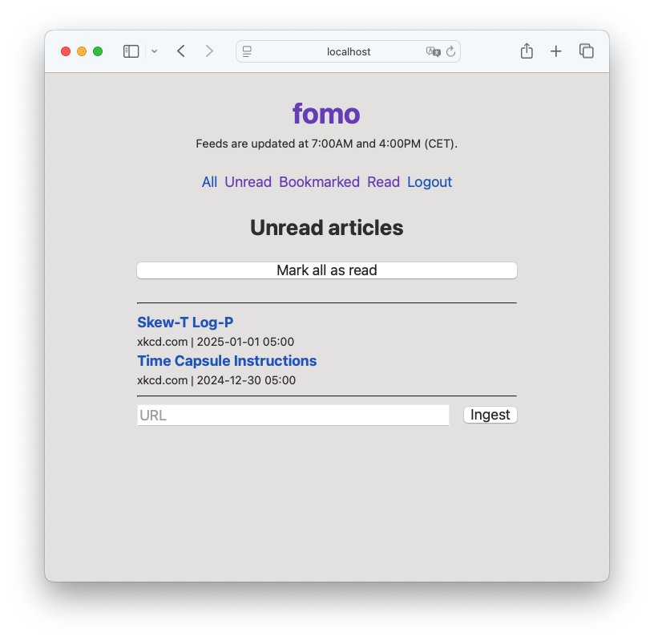
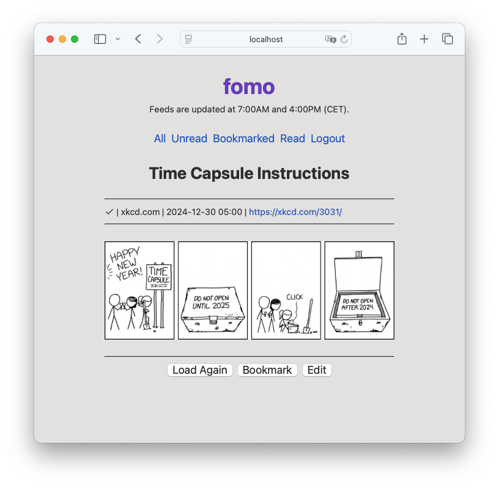

# fomo

A personal newsreader.

## Features

- Subscribe to **RSS**, **Atom**, and **JSON feeds**
- **Read articles** in a clean, distraction-free interface
- Manually **mark articles as read**, without doom-scrolling
- **Bookmark articles** for later
- **Auto-update feeds** on a schedule, no slot machine pull-to-refresh
- **Dark mode** for those late-night reading sessions
- **Self-hosted**: no ads, no tracking, no paywalls
- **No JavaScript**: just server-rendered HTML

## Usage

Use the docker image from [ghcr.io/cugu/fomo:latest](https://github.com/cugu/fomo/pkgs/container/fomo),
mount a custom configuration file to `/app/fomo/config.json`,
mount a volume to `/app/fomo/data` to store the database,
set the `FOMO_PASSWORD` environment variable to set the password for the service,
and expose the service on port 8080, e.g.:

```sh
docker run -d \
  -p 8080:8080 \
  -v ./config.json:/app/fomo/config.json \
  -v ./fomodata:/app/fomo/data \
  -e FOMO_PASSWORD=yourpassword \
  ghcr.io/cugu/fomo:latest
```

### Configuration

The configuration file is a JSON file with the structure shown below.

> [!WARNING]
> Comments are not allowed in the JSON file, they are only shown here for clarity.

```json5
{
  // URL where the service is hosted
  "base_url": "http://localhost:8080",
  // Port to listen on
  "port": 8080,
  // Times to update feeds
  "update_times": [
    7,
    16
  ],
  // List of feeds to subscribe to
  "feeds": {
    // simple RSS feed
    "xkcd.com": {
      "type": "rss",
      "url": "https://xkcd.com/rss.xml"
    },
    // lobste.rs feed with custom type
    "lobste.rs": {
      "type": "lobsters"
    },
    // rss feed, with fetching of the linked content
    "news.ycombinator.com": {
      "type": "rss",
      "url": "https://hnrss.org/frontpage?points=200",
      "fetch_link_content": true
    }
  }
}
```

## Screenshots

### List of articles



### Article view


